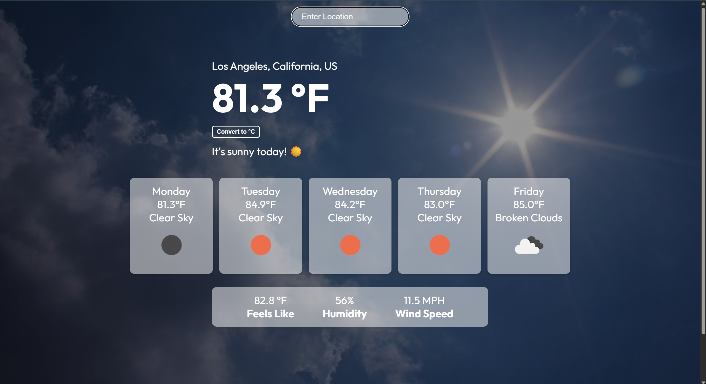
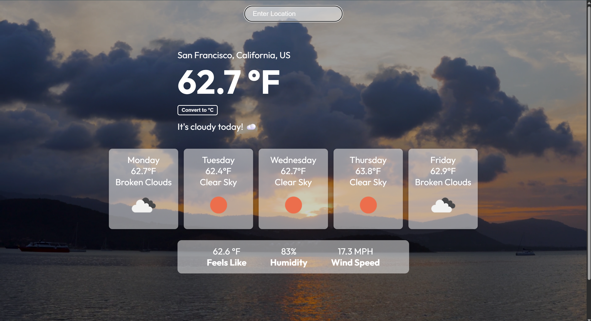

# 🌦️ Weather App (React + OpenWeatherMap API)

This is a weather application that utilizes the **OpenWeatherMap REST API** to display the current conditions and a 5-day forecast, with **dynamic video backgrounds** that change based on the weather (sunny, rainy, cloudy, etc.). The app uses a **Node.js + Express backend** to securely proxy API requests and protect the API key.

---

## Features
- Search weather by city
- Current temperature, humidity, and conditions
- 5-day forecast
- Live video backgrounds that adapt to weather conditions
- Node.js backend for API key protection
- Machine Learning Rain Predictor (trained on Kaggle climate dataset with Random Forest)

---

## Tech Stack
- **Frontend:** React (Create React App), Axios, CSS  
- **Backend:** Node.js + Express (for secure API proxying)  
- **API:** [OpenWeatherMap](https://openweathermap.org/api)
- **Machine Learning:** Python, Pandas, Scikit-learn (Random Forest Classifier) trained on Kaggle climate dataset
- **Version Control:** Git & GitHub

---
## Machine Learning Component
The app integrates a rain prediction model built with scikit-learn.
- **Dataset:** Historical global climate/weather dataset from Kaggle
- **Preprocessing:**
  - Merged multiple weather features (temperature, humidity, pressure, wind speed, etc.)
  - Converted weather descriptions into binary rain indicators
  - Engineered future rain labels (will it rain within the next 1–3 hours)
  - Added time-based features (month, hour)
- **Model:** Random Forest Classifier with class balancing (class_weight="balanced_subsample") to handle rain vs. no-rain imbalance
- **Workflow:**
  - Weather features from OpenWeatherMap API are passed to the ML backend.
  - The Random Forest model predicts if it will rain soon.
  - Prediction is displayed alongside live weather data.

## Limitations & Future Work
- The ML model uses a historical Kaggle dataset, so predictions may not always match current weather.
- Goal is to show the end-to-end ML pipeline, not perfect accuracy.
- Future work: train on newer data and try more advanced models.

---

## Installation

```bash
# 1. Clone the repository
git clone https://github.com/sanaka333/weather-app-react.git
cd weather-app-react

# 2. Install frontend dependencies
npm install

# 3. Go to the backend folder and install dependencies
cd weather-app-backend
npm install

# 4. Create a .env file in weather-app-backend/ with:
OPENWEATHER_API_KEY=your_api_key_here
PORT=5000

# 5. Go back to the project root
cd ..
```
---
## Running the App:

From the project root, run:
   ```bash
   npm run start:both
   ```
 ---






## Acknowledgments
This project was inspired by [Build A React JS Weather App - OpenWeatherMap API - Tutorial](https://www.youtube.com/watch?v=UjeXpct3p7M)  
Extended with custom features such as **dynamic video backgrounds** and a **secure Node.js backend** for API key protection.

## License
This project is licensed under the MIT License.

 


